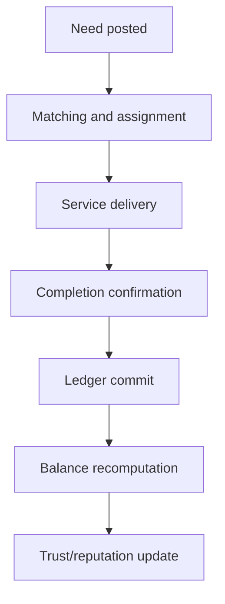
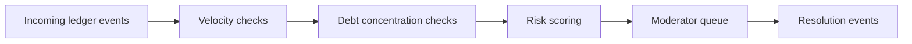
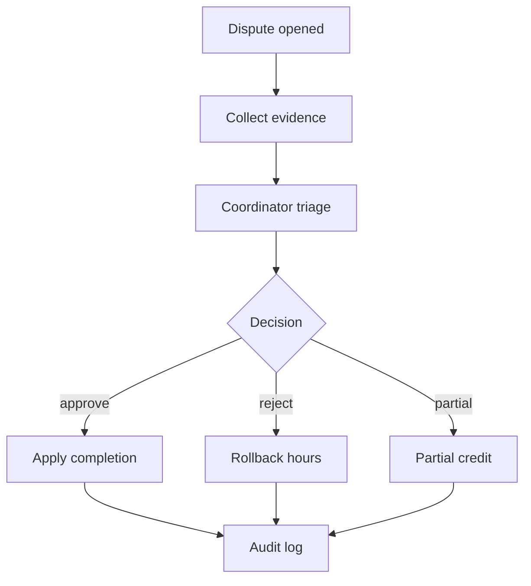
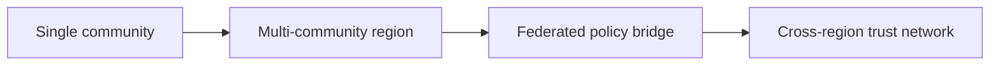

# Advanced Diagrams

## Timebank Transaction Lifecycle

```mermaid
flowchart TD
  A[Need posted] --> B[Matching and assignment]
  B --> C[Service delivery]
  C --> D[Completion confirmation]
  D --> E[Ledger commit]
  E --> F[Balance recomputation]
  F --> G[Trust/reputation update]
```

## Anti-Abuse Signal Flow

```mermaid
flowchart LR
  A[Incoming ledger events] --> B[Velocity checks]
  B --> C[Debt concentration checks]
  C --> D[Risk scoring]
  D --> E[Moderator queue]
  E --> F[Resolution events]
```

## Dispute Resolution Pipeline

```mermaid
flowchart TD
  A[Dispute opened] --> B[Collect evidence]
  B --> C[Coordinator triage]
  C --> D{Decision}
  D -- approve --> E[Apply completion]
  D -- reject --> F[Rollback hours]
  D -- partial --> G[Partial credit]
  E --> H[Audit log]
  F --> H
  G --> H
```

## Federation Expansion Path

```mermaid
flowchart LR
  A[Single community] --> B[Multi-community region]
  B --> C[Federated policy bridge]
  C --> D[Cross-region trust network]
```
