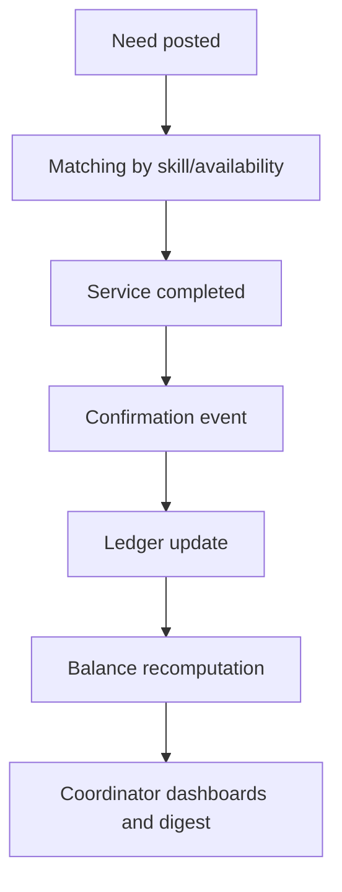
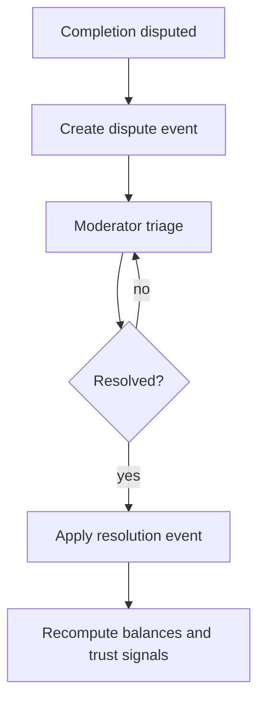
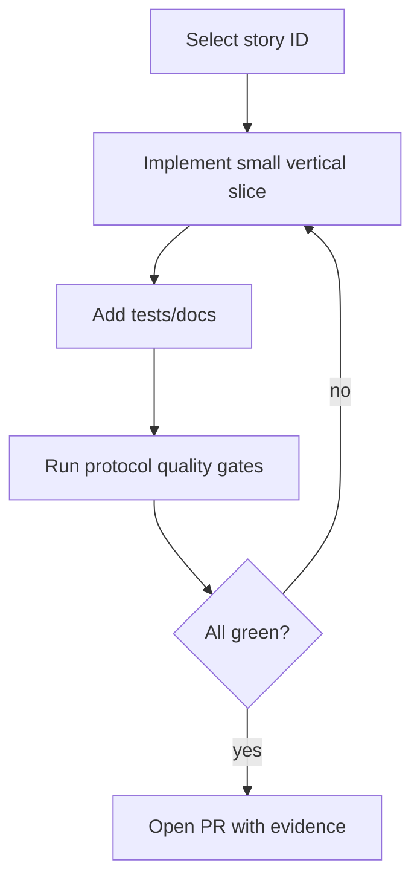

# Process Flows

## Need to Completion Flow

```mermaid
flowchart TD
  A[Need posted] --> B[Matching by skill/availability]
  B --> C[Service completed]
  C --> D[Confirmation event]
  D --> E[Ledger update]
  E --> F[Balance recomputation]
  F --> G[Coordinator dashboards and digest]
```

## Dispute Flow

```mermaid
flowchart TD
  A[Completion disputed] --> B[Create dispute event]
  B --> C[Moderator triage]
  C --> D{Resolved?}
  D -- no --> C
  D -- yes --> E[Apply resolution event]
  E --> F[Recompute balances and trust signals]
```

## PR Delivery Flow

```mermaid
flowchart TD
  A[Select story ID] --> B[Implement small vertical slice]
  B --> C[Add tests/docs]
  C --> D[Run protocol quality gates]
  D --> E{All green?}
  E -- no --> B
  E -- yes --> F[Open PR with evidence]
```
