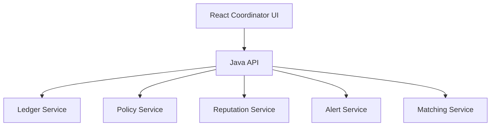

# System Design

## Architecture

## Protocol Invariants

- Canonical balances are backend computed only.
- Ledger replay must be deterministic.
- Every transaction and moderation action is auditable.
- Policy versions are explicit in outputs.

## Non-Functional Targets

- Transparent fairness behavior.
- Low-friction coordinator operations.
- Resilience against abuse patterns.
- Portable ledger exports.
